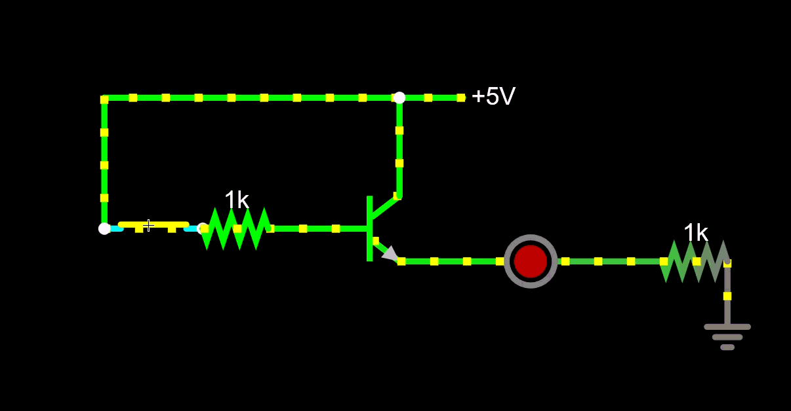
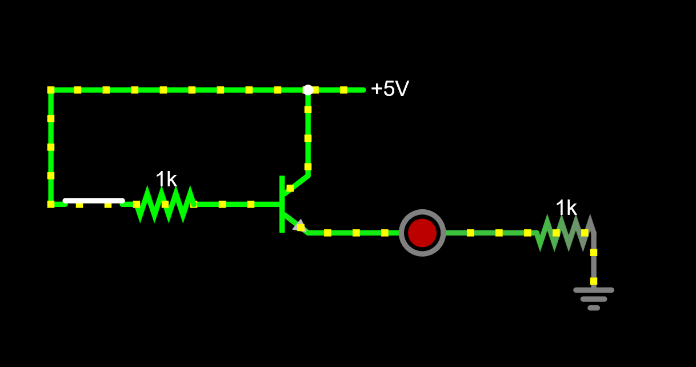
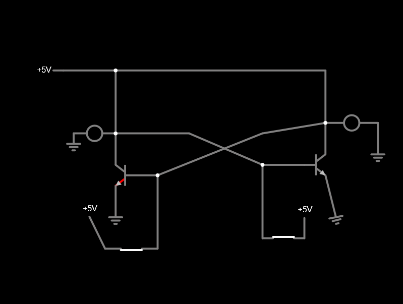
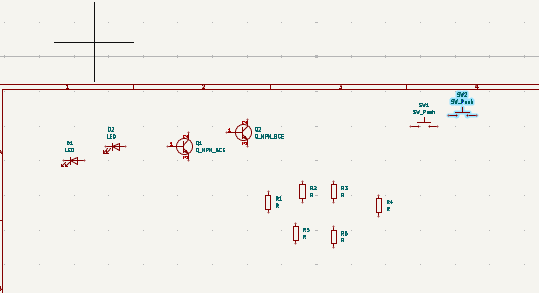
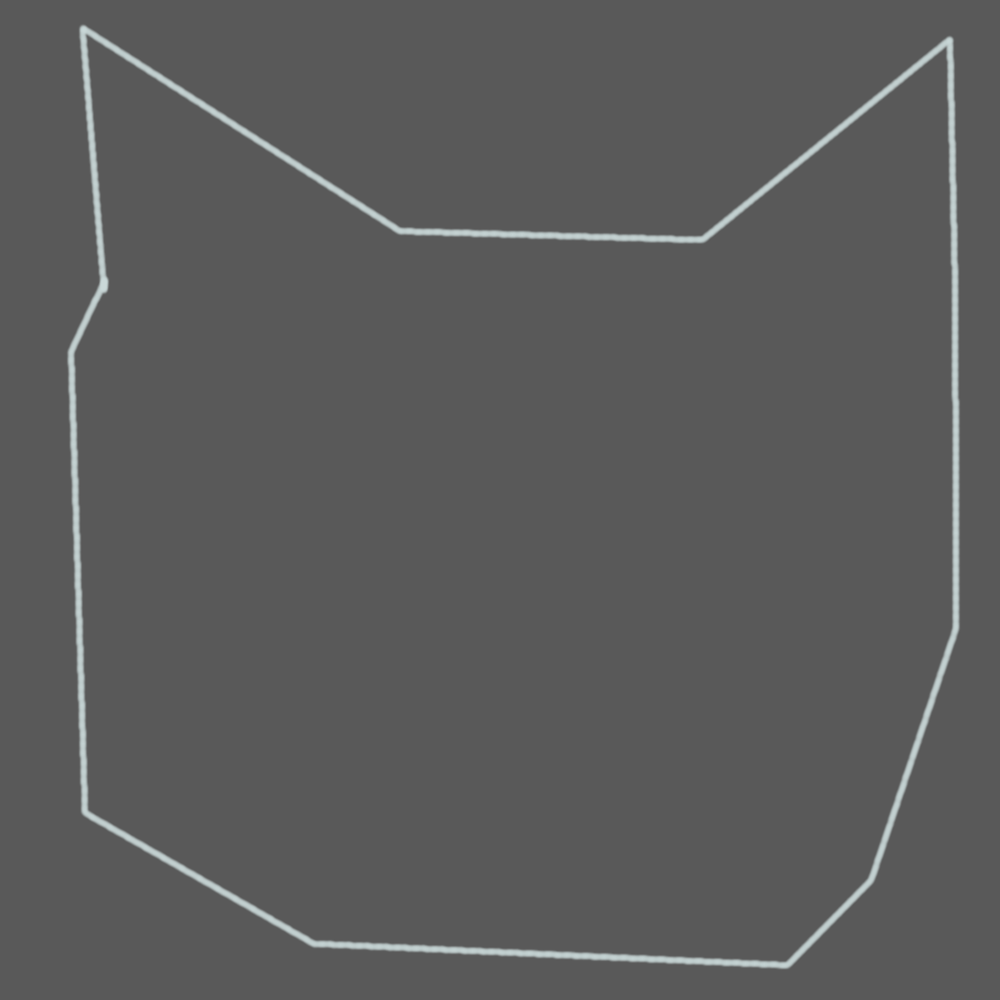
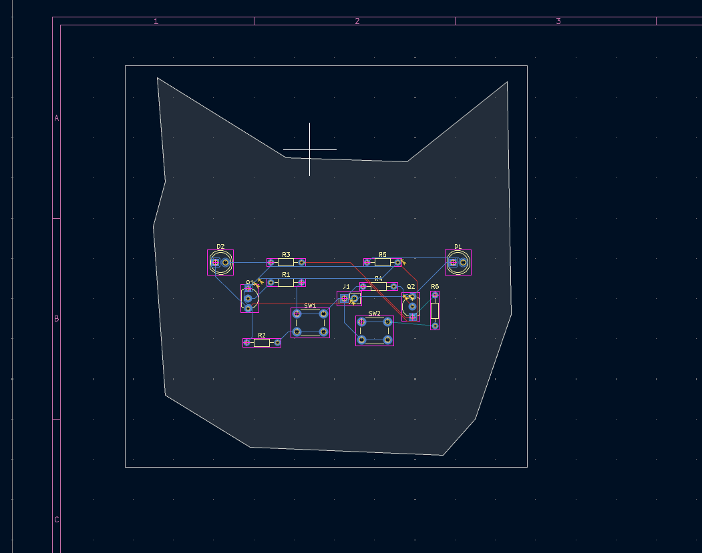
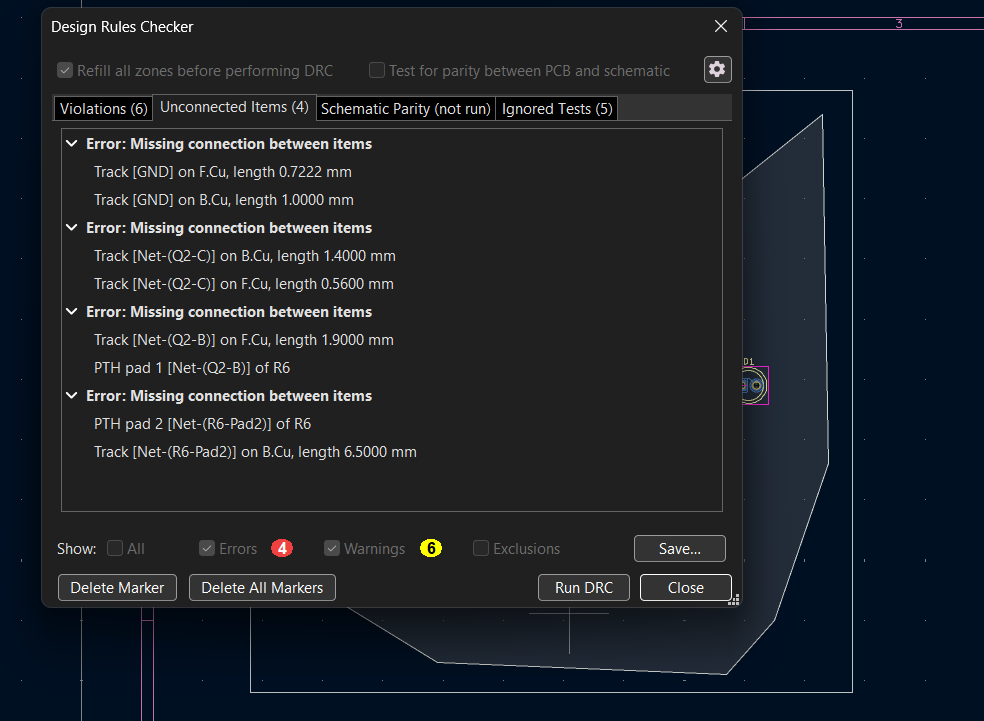
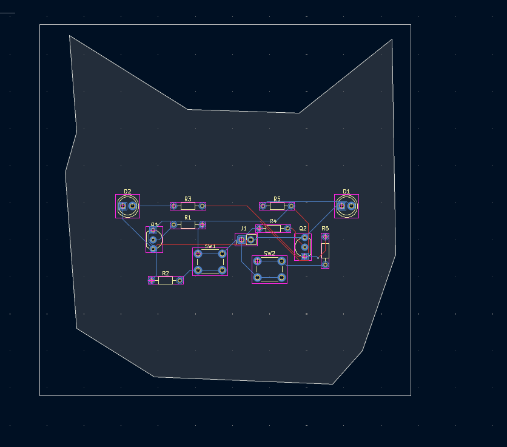
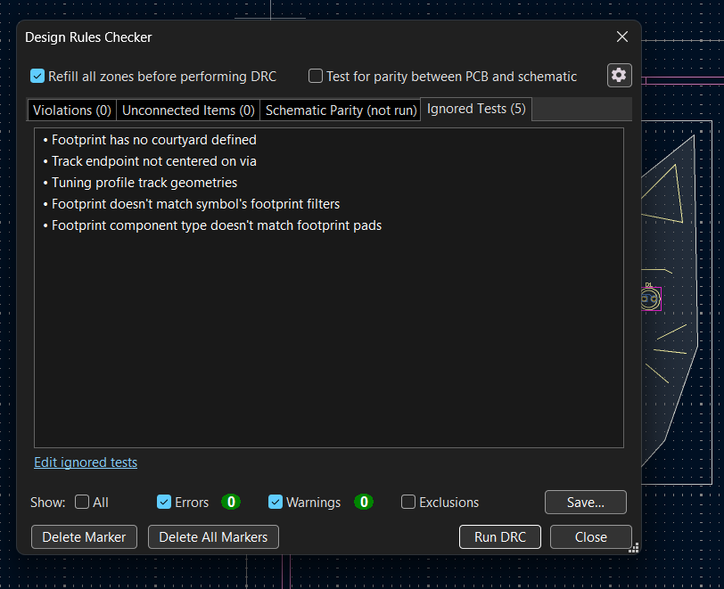

#    Bistable-Kitty-Multivibrator-Circut
## 4/7/2026
I did this all in one day btw
I'm building a bistable multivibrator because resolution week 2 required it and I didn't want to do the exact PCB rudy did and its cool.
TOTAL TIME: 3hr 21 min

Ok So i competled the first circut with the transitor pretty easily! Here are some pics:

Now i've been tryna make the circut that i would actually be using in the pcb. to be honest this is a big jump -kinda scared. So at first i tried looking online at like intrutables etc. but the circuts there seemed to hard so decided to first try and copy the Bistable Multivibrator. Here is the attemp:

honestly this was lowk to hard so i almosted decided to kinda give up on it. it doens't work even thought i liitteraly looks like the one in the gif's w/o the resitors. So second attemp i tried pressing "run" cause its werid the entire circut was grey and it told me this "path to ground with no resitiance. So i guess i have to add resitors! Ok second attemp - IT WORKS LOOKE HERE:

Adding resitors was the problem. I'm guessing cuz like the flow/current was the same til ground and like eletricity goes from most resitance to least so having same exact all through out means the electricity dunno where to go. So honestly im SUPER duper proud of myself OMG like the 1st week took my like 6 hours which hella demotivated me but im 40 minutes in and I'm already done with designing the circut. Ok now ima move onto the KICAD (the exciting part)

Ok just basically following the tutorial. i have 6 resitors, 2 led 2 npn transitoris 2 switches. Here is them all laided out:

Ok then i connected all the wires together, aded the connector things and added values for the resitors then here is the completed schematics:

Ok so i designed the outline of my PCB inside of krita. It was like a cat face. Heres the Image:

Then after i got that outlined/cut out i kinda just went with my PCB and Schematic editor hand by hand to place the compoments. I bascally kinda mapped out the compoments like how i mapped them in Faslted Lab/the schematic editor then i ended/roate some things so that the blue lines wouldn't be as crazy and i think i did a good job:

Ok i hate this SO much took me about 40 minutes for the first one. But first try is a fail! its my first time routing and t was very confusing. I checked with DRC and i just can't get a couple routes to connect and i think its cause i did some REALLY bad rounting before. Here is the picture of the first routing job:

Ok So rounting was GENUILY killing me. Like i was fr about ot quit. Until my GOAT rohan Dm'd me and we hopped on a huddle and he flowkenly helped me. BUT i forgot to laspe from that point. But looking at the time of the huddle it took about 15 minutes for me to finish the rounting. So i had about 4-6 incomplete routings that were showin up in DRC. So about 2 of them were wirings that just didn't connected to anything and i probably put them there in acidently LOL and the other ones I had to use a "via" (i think thats how you call it) to be able to rounte it as i needed to connect the back and front layer. and the last one was just something i forgot to connect LOL. Here is the completed PCB rounting:

Ok Honestly That took 15 minutes so now we are at the last stages. Honestly I don't think the rest is going to take more than 10 extra minutes so I don't think ima laspe that I'm just going to journal it. Laspe is honestly pretty buggy and slowed down my screen.

So this was easy. only 16 minutes in total. I added Cat ears, Wiskers, and eyebrows, and a mouth to my PCB! Now it looks like a drippy cat smiling at your!! It was in the front layer to. And i added the marking for front and back + i added some text Here are some pictures:

DRC Check:

Finished!!! i'm super proud this didn't took as long as week 1 and i made my first PCB!!!

Cool 3d render:

