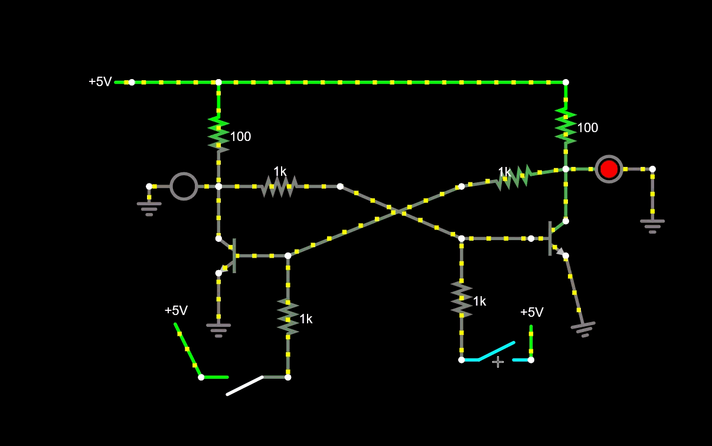
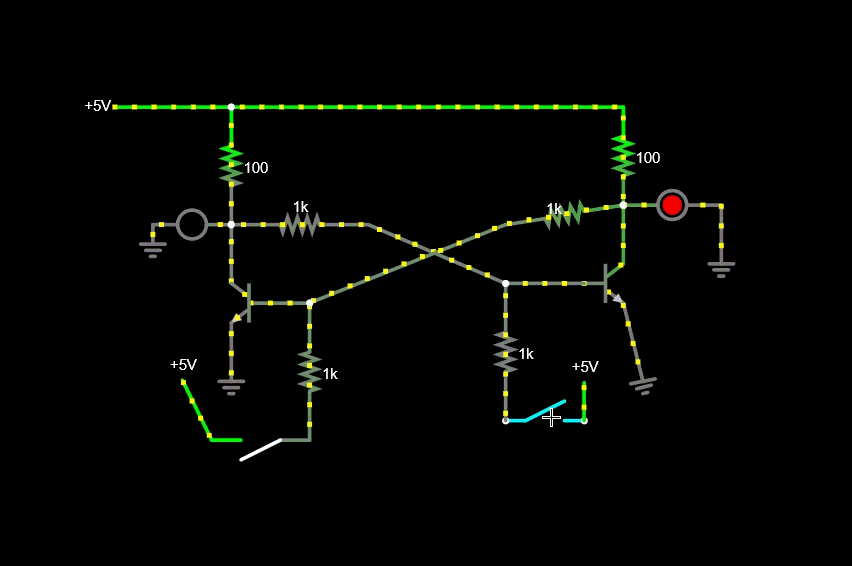
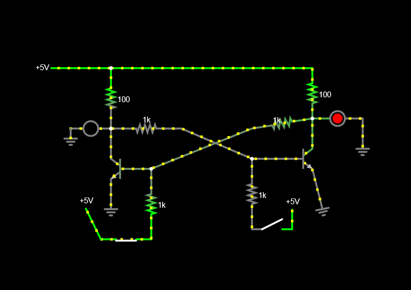
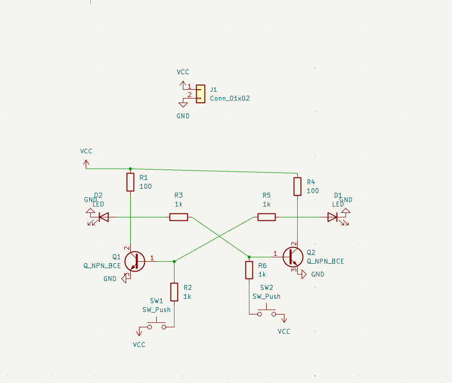
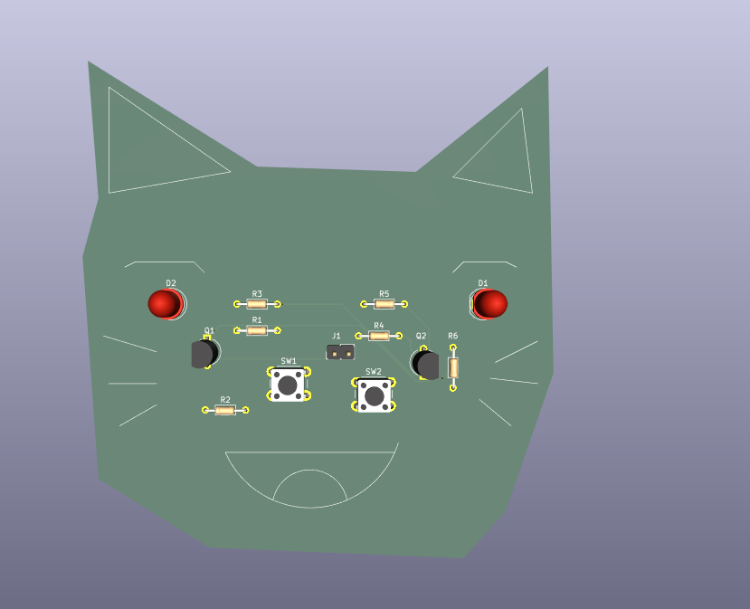
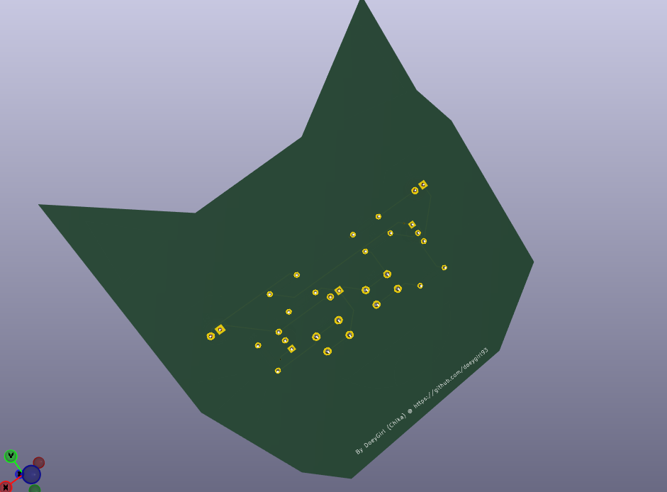
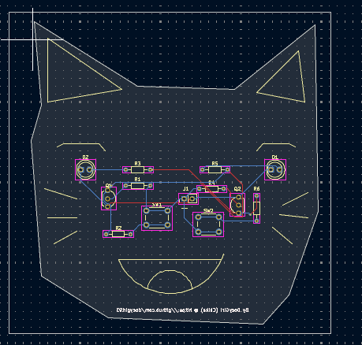

# Bistable Kitty Multivibrator
###### TOTAL TIME: 3hr 21min

This is a PCB for a Bistable multivibrator. I made it cause we were forced to in Reslution hardware week 2. But I choose this spefic circut because I liked how there are only 2 states and it could be useful for many other circuts like analog so I thought this would be a useful on to pratice

---

## Simulation

So this works like a flipflop. SO this type of circut only has 2 stable states and it always remains inside on the state until you physically switch to another. And while one is on the other has to be off. In context of digital circuts it can be used as basic memory elements. And i used 6 resitors, 2 led 2 npn transitoris 2 switches.

[Link to Demo]($ 1 0.000005 10.20027730826997 50 5 50 5e-11
R 512 160 480 160 0 0 40 5 0 0 0.5
w 512 160 592 160 0
162 592 256 528 256 2 default-led 1 0 0 0.01
g 528 256 528 272 0 0
w 592 256 592 304 0
t 656 320 592 320 0 1 -0.3882099641741541 0.6902026669380696 100 default
g 592 336 592 384 0 0
w 704 256 816 304 0
w 656 320 816 256 0
w 592 160 912 160 0
162 912 240 992 240 2 default-led 1 0 0 0.01
g 992 240 992 288 0 0
s 656 432 576 432 0 1 false
R 576 432 544 368 0 0 40 5 0 0 0.5
w 912 240 912 288 0
t 880 304 912 304 0 1 -0.38820996417420517 0.6902026669380692 100 default
w 816 304 880 304 0
s 816 416 880 416 0 1 false
R 880 416 880 368 0 0 40 5 0 0 0.5
g 912 320 928 384 0 0
r 592 256 592 160 0 100
r 912 160 912 240 0 100
r 816 256 912 240 0 1000
r 704 256 592 256 0 1000
r 656 320 656 432 0 1000
r 816 304 816 416 0 1000
)

---
## Schematic

## PCB

---

Uhh Thanks to Rohan for helping me for reminding me to do week 2 and teaching me how to fix the Routing my PCB! I was lowk finna give up without it. Also thanks for Rudy for lettting me submit this late😭
